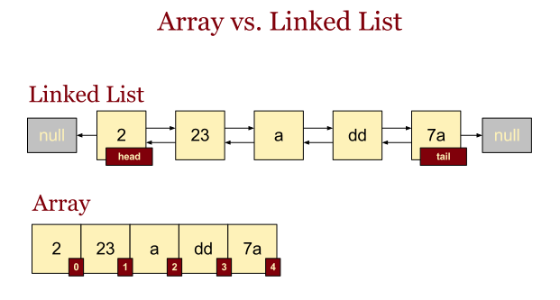
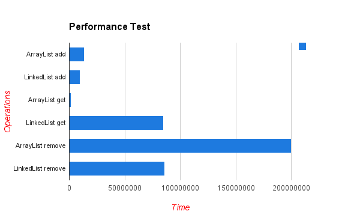

# List

## ArrayList vs LinkedList
### Structure의 차이점


|ArrayList|LinkedList|
|---------|----------|
|index가 존재|앞, 뒤 원소의 위치값 존재|

### Performance의 차이점

- 위 성능 측정 그래프는 평균을 통계낸 것이기 때문에 index로 삽입/삭제/조회를 하느냐, value로 삽입/삭제/조회를 하느냐에 따라 조금은 다른 수치를 보인다.
- index가 존재하는 ArrayList는 조회 시 평균적으로 좋은 성능을 보이지만, 삽입/삭제 인덱스 재배치를 통해 공간을 조절하기 때문에 비효율적인 성능을 보인다
> 순차적으로 삽입/삭제하거나 조회하는 경우에는 ArrayList가 빠르지만,
> 중간 데이터(비 순차적)를 삽입/삭제하는 경우에는 LiknedList가 빠르다

> 즉, FIFO(First In First Out)나 FILO(First In Last Out)처럼 삽입/삭제가 일정하게 앞이나 뒤에서 일어나는 경우를 제외하고는
> 삽입/삭제가 잦은 경우 LinkedList, 조회가 잦은 경우 ArrayList를 이용하면 될 것 같
#### Time Complexity
|                    | method                                                  | ArrayList | LinkedList |
|--------------------|---------------------------------------------------------|-----------|------------|
| add at last index  | add(value) (LinkedList -> add(value),addLast())         | O(1)      |O(1)|
| add at given index | add(index,value)                                        | O(N)      |O(1)|
| remove by index    | remove(index) (LinkedList->remove(index),removeFirst()) | O(N)      |O(1)|
| remove by value    | remove(value)                                           | O(N)      |O(1)|
| get by index       | get(index)                                              | O(1)      |O(N)|
| get by value       | get(value)                                              | O(N)      |O(N)|
| search by value    | contain(value), indexOf(value)                          | O(N)      |O(N)|  
#### Example
```java
   if (list.contains(target)) {
                runTime += 1;
                list.remove(target);
            } else {
                runTime += 5;
                if (list.size() != 0 &&
                        list.size() >= givenSize) {list.remove(0);}
            }
            if(cacheSize != 0){ list.add(target); }
```
- remove()와 add()는 특정 조건에서 작동하지만 contains()을 통한 조회는 매번 조건을 판단하기 위해 매번 이루어진다
- 실제 테스트 결과 이 경우 LinkedList보다 ArrayList일 때 퍼포먼스가 더 낫다 (PG_17680 참고)
<br>

##### References
- [LinkedList 사용법](https://hbase.tistory.com/125)
- [ArrayList와 LinkedList의 차이](https://dev-coco.tistory.com/19)
- [Queue가 ArrayList 대신 LinkedList를 사용하는 이유](https://devlog-wjdrbs96.tistory.com/246)