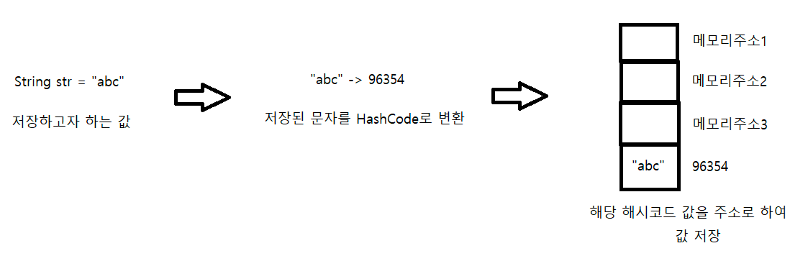
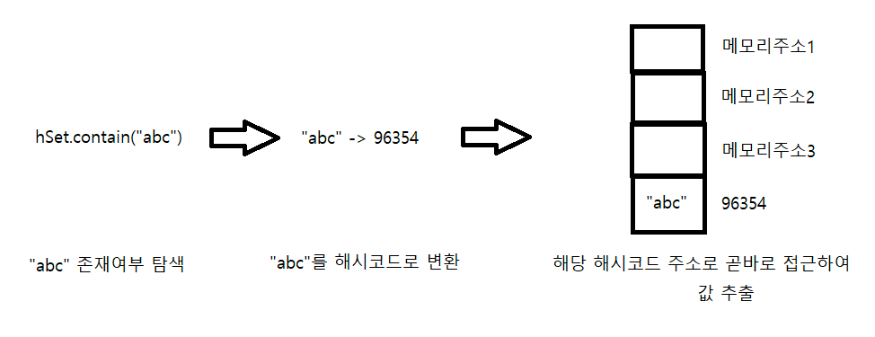
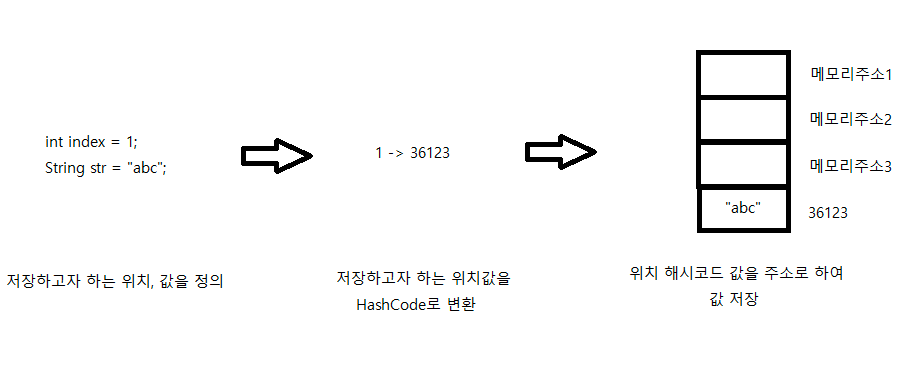
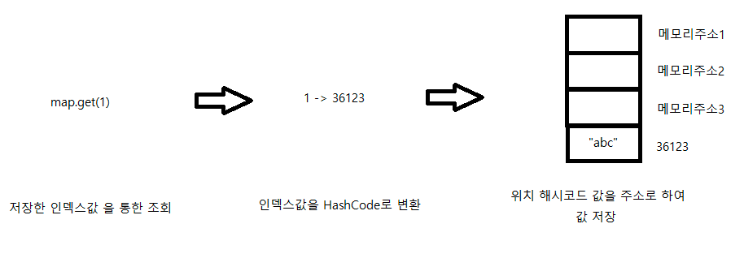

## Map

### Set vs Map
|Set|Map|
|---|---|
|값이 곧 인덱스 (값을 해시 코드로 변환해 해당 위치에 저장)|값과 인덱스 구분 (인덱스를 해시 코드로 변환해 해당 위치에 값 저장)|
#### Save Set
- 저장하고자 하는 값의 해시코드값이 곧 주소

#### Query a Set
- 찾고자 하는 값의 해시코드값이 주소값인 요소 리턴

#### Save Map
- 저장하고자 하는 key 값의 해시코드값이 곧 주소
- 주소에는 value 값이 저장되어 있음

#### Query a Map
- 찾고자 하는 key 값의 해시코드값이 주소값인 요소 리턴


### Map에 특정 key 존재 여부 확인하기
- `Map.containsKey()`
  - `null`도 key로 사용 가능
    ```java
    map.put(null, "value");
    
    map.containsKey(null);   // true
    ```

- `Map.get()`
  - 존재하면 입력받은 값을 리턴
  - 존재하지 않으면 null 리턴

### Map 첫 번째 Key, value 얻기
- get First key
  - `map.get(map.keySet().toArray()[0])`
- get First value
  - `map.values().toArray()[0]` // type: Object

#### References
- [Set vs Map](https://readerr.tistory.com/37)
- [containsKey() vs get()](https://hianna.tistory.com/574)
- [get First key and value](http://daplus.net/java-hashmap-%EC%B2%AB-%EB%B2%88%EC%A7%B8-%ED%82%A4-%EA%B0%92-%EC%96%BB%EA%B8%B0/)