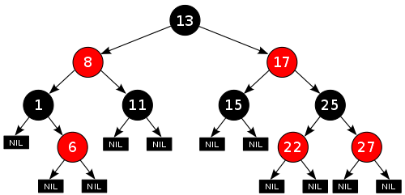

## Map

### Set vs Map
|Set|Map|
|---|---|
|값이 곧 인덱스 (값을 해시 코드로 변환해 해당 위치에 저장)|값과 인덱스 구분 (인덱스를 해시 코드로 변환해 해당 위치에 값 저장)|
#### Save Set
- 저장하고자 하는 값의 해시코드값이 곧 주소

#### Query a Set
- 찾고자 하는 값의 해시코드값이 주소값인 요소 리턴

#### Save Map
- 저장하고자 하는 key 값의 해시코드값이 곧 주소
- 주소에는 value 값이 저장되어 있음

#### Query a Map
- 찾고자 하는 key 값의 해시코드값이 주소값인 요소 리턴


### Map에 특정 key 존재 여부 확인하기
- `Map.containsKey()`
  - `null`도 key로 사용 가능
    ```java
    map.put(null, "value");
    
    map.containsKey(null);   // true
    ```

- `Map.get()`
  - 존재하면 입력받은 값을 리턴
  - 존재하지 않으면 null 리턴

### Map 첫 번째와 마지막 Key, value 얻기
- get First key
  - `map.keySet().toArray()[0]`
- get First value
  - `map.get(map.keySet().toArray()[0])`
  - `map.values().toArray()[0]` // type: Object
- get Last key
  - `map.keySet().toArray()[map.size() - 1]` // Don't forget -1
- get Last value
  - `map.get(map.keySet().toArray()[map.size() - 1])`
  - `map.values().toArray()[map.size() - 1]`

<br>

### Tree Map
> 이진트리(레드-블랙 트리)를 기반으로 한 Map 컬렉션
- TreeMap에 객체를 저장하면 자동으로 정렬
  - 정렬 기준
    - Default: 오름차순 
      - 부모 키값과 비교해서 키 값이 낮은 것은 왼쪽 자식 노드에 키값이 높은 것은 오른쪽 자식 노드에 Map.Entry 객체를 저장 (Red-Black-Tree)
      - 내림차순 정렬 시 `Collections.reverseOrder()` 이용
        - TreeMap<Integer, Integer> map = new TreeMap<>(Collections.reverseOrder());
    - 숫자 타입: 값으로 정렬
    - 문자열 타입: 유니코드로 정렬
  - 성능
    - Efficient: 추가, 삭제가 잦은 경우 HashMap보다 비효율적 
    - Inefficient: 정렬된 상태로 Map을 유지해야 하거나 정렬된 데이터를 조회해야 하는 범위 검색이 필요한 경우
- TreeSet과의 차이점
  - TreeSet은 그냥 값만 저장한다면 TreeMap은 키와 값이 저장된 Map, Entry 저장한다는 점
#### Red-Black-Tree
레드 블랙 트리
> 이진탐색트리의 문제점을 보완
-  일반적인 이진 탐색 트리는 트리의 높이만큼 시간이 필요
  - Problem: 값이 전체 트리에 잘 분산되어 있다면 효율성에 있어 크게 문제가 없으나 데이터가 들어올 때 값이 한쪽으로 편향되게 들어올 경우 한쪽 방면으로 크게 치우쳐진 트리가 되어 굉장히 비효율적인 퍼포먼스를 냄
- Solution: 부모 노드보다 작은 값을 가지는 노드는 왼쪽 자식으로, 큰 값을 가지는 노드는 오른쪽 자식으로 배치하여 데이터의 추가나 삭제 시 트리가 한쪽으로 치우쳐지지 않도록 균형을 맞춤
#### References
- [Set vs Map](https://readerr.tistory.com/37)
- [containsKey() vs get()](https://hianna.tistory.com/574)
- [get First key and value](http://daplus.net/java-hashmap-%EC%B2%AB-%EB%B2%88%EC%A7%B8-%ED%82%A4-%EA%B0%92-%EC%96%BB%EA%B8%B0/)