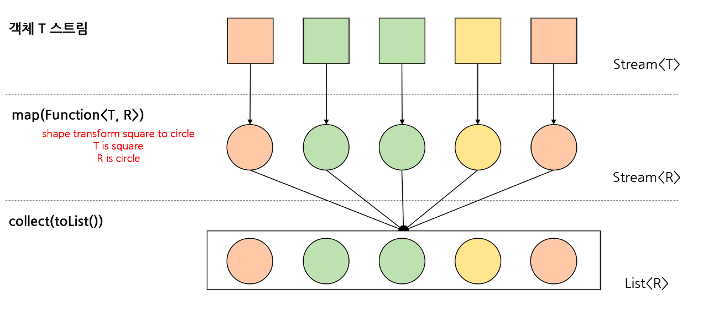
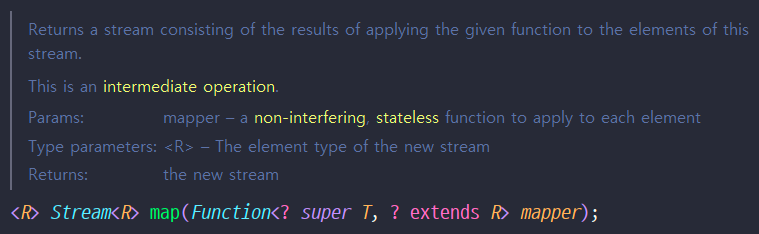
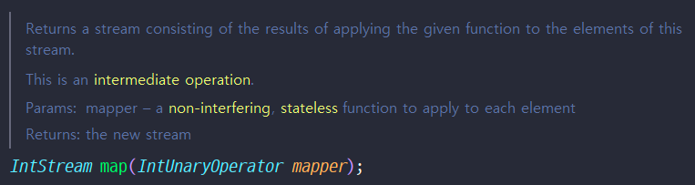
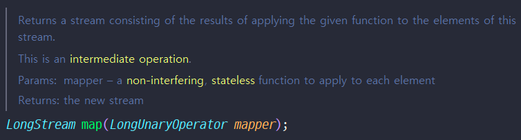
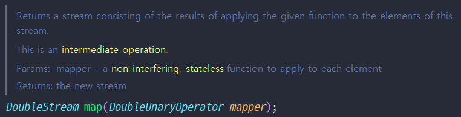

# Stream
## reduce와 collect 차이
### Reduction(reduce)
> T 타입에 대한 항등원에서 시작해서, 해당 이항 연산을 모든 T 타입 List의 원소들을 대입하여 연쇄적으로 계산

> 다시 말해, **T**에 대한 **이항 연산**을 반복하며 **T 타입 리스트를 한 바퀴 도는 것**이다

#### reduce의 input type과 output type
```java
// 1개 (accumulator)
Optional<T> reduce(BinaryOperator<T> accumulator);

// 2개 (identity)
T reduce(T identity, BinaryOperator<T> accumulator);

// 3개 (combiner)
<U> U reduce(U identity,
        BiFunction<U, ? super T, U> accumulator,
        BinaryOperator<U> combiner);
```
  - reduce는 타입이 T 한 가지로 고정되어 있다
  - `항등원(identity)`과 `이항연산자(BinaryOperator)`라는 다분시 수학적인 작명의 파라미터를 지니고 있다
    <br>
  - 3개의 인자를 받는 경우에는 combiner까지 받는다 
    - Combiner 는 병렬 처리 시 각자 다른 쓰레드에서 실행한 결과를 마지막에 합치기 때문에 병렬 스트림에서만 동작한다
  
    | Parameter | Description|
    |-----------|-----------|
    |accumulator | 각 요소를 처리하는 계산 로직. 각 요소가 올 때마다 중간 결과를 생성하는 로직|
    |identity | 계산을 위한 초기값으로 스트림이 비어서 계산할 내용이 없더라도 이 값은 리턴|
    |combiner | 병렬(parallel) 스트림에서 나눠 계산한 결과를 하나로 합치는 동작하는 로직|
#### reduce 메서드 작동 구조
```java
public <T> T streamReduce(List<T> tList, T identity, BinaryOperator<T> accumulator) {
for(T t : tList) {
accumulator.apply(identity, t);
}
return identity;
}
```
- ex
  - 항등원(identity)가 0이고, 이항연산자(BinaryOperator)가 +라면
    - 0 + 1 => 1 (항등원 + list[0])
    - 1 + 2 => 3 (앞의 연산 결과 + list[1])
    - 3 + 3 => 6 (앞의 연산 결과 + list[2])
    - 6 + 4 => 10 (앞의 연산 결과 + list[3])
    -    ...
    - 45 + 10 => 55 (앞의 연산 결과 + list[9])
### Collector(collect)
> accumulator 기능과 호환 가능한 value를 combine
#### collect의 input type과 output type
```java
  <R> R collect(Supplier<R> supplier,
                  BiConsumer<R, ? super T> accumulator,
                  BiConsumer<R, R> combiner);
```
- output 타입은 R 타입이고, input list의 타입은 T 계열(정확히는, ? super T)이다
### collect의 작동구조
1. `supplier` 로 `R 타입 인스턴스`를 생성한다.
2. 생성한 R 인스턴스에 `accumulator` 로 `T list`들을 합친다.(R 인스턴스에 T list 의 아이템들을 하나하나 축적해나간다.)
3. (parallel stream의 경우) 여러 스레드가 부분적으로 1, 2를 실행하여 얻어낸 R 타입 결과물들을 `combiner` 를 이용하여 하나로 합친다.

### reduce와 collect 사용하는 케이스?
| reduce                                          |collect|
|-------------------------------------------------|-------|
|List와 output의 타입이 같고, 이항 연산의 연쇄 작용으로서의 의미가 강한 경우 |리스트와 타입이 다른 output을 내는 경우|


## Collectors.groupingBy()
>`groupingBy(classifier, downstream)` Collector는 Stream 요소를 Map에 따라 Grouping하여 수집, Classifier로 분류, 최종적으로 Map 인스턴스에 저장
###  스트림에서 요소의 발생 횟수(빈도) 계산
#### EX 1

```java
import java.util.Map;
import java.util.function.Function;
import java.util.stream.Collectors;
import java.util.stream.Stream;


class Main {
    public static void main(String[] args) {
        Map<String, Long> freq = Stream.of("A", "B", "A", "C", "A", "C")
                .collect(Collectors.groupingBy(Function.identity(), Collectors.counting()));

        System.out.println(freq);
    }
}
```
#### EX 2 : 문자열을 두 글자씩 끊어서 빈도수 계산하기 (PG_17677)
```java
    private Map<String, Long> group(String word) {
        return IntStream.range(0, word.length() - 1)
                .mapToObj(index -> word.substring(index, index + 2))
                .filter(text -> text.chars().allMatch(character -> Character.isAlphabetic((char) character)))
                .collect(Collectors.groupingBy(Function.identity(),Collectors.counting()));
    }
```

## Mapping
> Stream 내 요소들에 대해 함수가 적용된 결과의 새로운 요소로 매핑

기존 값을 변경한다는 개념보다는 새로운 값을 만든다는 개념이므로 변환(transforming) 에 매핑(mapping) 이라는 단어를 사용한다.

### map 연산 output type
**자기 자신** 타입의 스트림을 반환
#### Stream의 map 메서드

#### IntStream의 map 메서드

#### LongStream의 map 메서드

#### DoubleStream의 map 메서드


### mapToInt, MapToLong, MapToDouble, MapToObj
> 기본형 특화 Stream을 각 타입의 stream으로 변환해주는 메서드
### EX 1 : 문자열을 문자열 길이로 변환하기
```java
public List<Integer> getLength(List<String> strings) {
    return strings.stream()
            .map(String::length)
            .collect(Collectors.toList());
}
```
### EX 2 : 객체에서 특정 속성 가져오기
실외 스포츠들의 이름 가져오기
```java
public List<String> getSportsNamesByIndoor(List<Sports> sports, boolean isIndoor) {
    return sports.stream()
            .filter(s -> s.isIndoor() == isIndoor)
            .map(Sports::name)
            .collect(Collectors.toList());
}
```
### EX 3 : 중복 제거
#### EX 3-1 : 요소에 대한 중복 제거
```java
void mapTest() {
    printHumanNames("before = "+ humans);

    List<String> names = humans.stream()
            .map(h -> h.getName())
            .distinct()
            .collect(Collectors.toList());

    System.out.println("afte r= ");
    for (String name : names) {
        System.out.print(name + " ");
    }
// return
// before = jojae haha arabia cici zzang ssu kuku kuku
// after =  jojae haha arabia cici zzang ssu kuku
```
#### EX 3-2 : 내부요소에 대한 평면화 (flatMap)하여 중복 제거
```java
void mapTest() {
    printHumanNames("before = "+ humans);

    List<String> humanNameWords = humans.stream()
            .map(h -> h.getName().split(""))
            .flatMap(Arrays::stream)
            .distinct()
            .collect(Collectors.toList());

    System.out.println("after = ");
    for (String humanNameWord : humanNameWords) {
        System.out.print(humanNameWord + " ");
    }
}
// return
// before = jojae haha arabia cici zzang ssu kuku kuku
// after =  j o a e h r b i c z n g s u k
```
### EX 4 : 자료의 모든 값 증가 연산 (PG_42583)
```java
List<Integer> peekDuration = new ArrayList<>();

peekDuration = peekDuration.stream().map(el -> {return el+1;}).collect(Collectors.toList()); // peekDuration 각 요소 1씩 증가
```
#### References
- [stream 과 parallel stream, reduce 와 collect 의 차이와 사용법](https://m.blog.naver.com/PostView.naver?isHttpsRedirect=true&blogId=woong17&logNo=221268337085)
- [Java 스트림 Stream (1) 총정리](https://futurecreator.github.io/2018/08/26/java-8-streams/)
- [Java 8 groupingBy Collector 가이드](https://www.baeldung.com/java-groupingby-collector#3-groupingby-with-a-complex-map-key-type)
- [Java의 수집기 groupingBy() 메서드](https://www.techiedelight.com/ko/collectors-groupingby-method-java/)
- [[Stream API] 중간 연산 - map 메서드](https://dev-kani.tistory.com/32)
- [java stream 정리(map)](https://isntyet.github.io/java/java-stream-%EC%A0%95%EB%A6%AC(map)/)