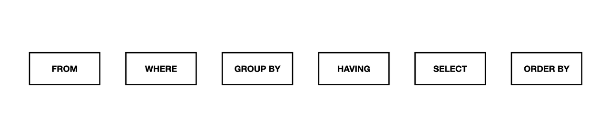

## SQL 실행순서
> FROM - WHERE - GROUP BY - HAVING - SELECT - ORDER BY


1. `FROM` :  조회 테이블 확인<br>
   SELECT부터 처리할 것 같지만, 쿼리의 가장 첫 번째 실행 순서는 FROM 절입니다. FROM 절에서는 테이블의 모든 데이터를 가져옵니다.
2. `WHERE` : 데이터 추출 조건 확인<br>
   FROM절에서 읽어온 데이터중에서 조건에 일치하는 데이터만 가져옵니다.
3. `GROUP BY` : 컬럼 그룹화<br>
   WHERE 조건에서 읽어온 데이터를 선택한 컬럼으로 그룹화하여 단일 값으로 축소합니다.
4. `HAVING` : 그룹화 조건 확인<br>
항상 group by뒤에 위치하고 where 조건절과 마찬가지로 조건을 줄 수 있습니다. 차이점으로는 where 절은 기본적인 조건절로서 우선적으로 모든 필드를 조건에 둘 수 있지만 having 절은 group by 된 이후 특정한 필드로 그룹화된 새로운 테이블에 조건을 줄 수 있습니다.
5. `SELECT` : 데이터 추출<br>
   여러 조건들을 처리한 후 남은 데이터에서 어떤 열을 출력할지 선택합니다.
6. `ORDER BY` : 데이터 순서 정렬<br>
   마지막으로 행의 순서를 정렬합니다.
## JOIN
### Inner Join
> 양쪽 모두에 값이 있는 행(NOT NULL) 반환
### Left/Right Outer Join
>반대쪽에 데이터가 있든 없든(NULL), 선택된 방향에 있으면 출력 - 행 수 결정
### 다중 조인
```sql
SELECT 
  C.CategoryID, C.CategoryName, 
  P.ProductName, 
  O.OrderDate,
  D.Quantity
FROM Categories C
JOIN Products P ON C.CategoryID = P.CategoryID
JOIN OrderDetails D ON P.ProductID = D.ProductID
JOIN Orders O ON O.OrderID = D.OrderID;
```
### 다중 조인 후 그룹화하기
```sql
SELECT 
  C.CategoryName, P.ProductName,
  MIN(O.OrderDate) AS FirstOrder,
  MAX(O.OrderDate) AS LastOrder,
  SUM(D.Quantity) AS TotalQuantity
FROM Categories C
JOIN Products P ON C.CategoryID = P.CategoryID
JOIN OrderDetails D ON P.ProductID = D.ProductID
JOIN Orders O ON O.OrderID = D.OrderID
GROUP BY C.CategoryID, P.ProductID;
```
## String, Date
### DATE_FORMAT
> DATE_FORMAT(`날짜컬럼`, `형식`) : 날짜 컬럼을 지정한 형식으로 출력

| 구분기호 | 역할|
|------|------|
| %Y   |4자리 년도|
| %m   |숫자 월 (두자리)|
| %y   |2자리 년도|
| %c   |숫자 월(한자리는 한자리)|
| %M   |긴 월(영문)|
| %d   |일자 (두자리)|
| %b   |짧은 월(영문)|
| %e   |일자(한자리는 한자리)|
| %W   |긴 요일 이름(영문)|
| %I   |시간 (12시간)|
| %a   |짧은 요일 이름(영문)|
| %H   |시간(24시간)|
| %i   | 분|
| %r   | hh:mm:ss AM,PM|
| %T   |hh:mm:SS|
| %S   |초|

##### References
- [MySQL 실행순서](https://nohriter.tistory.com/129)
- [MySQL Date Format](https://devjhs.tistory.com/89)
- [Join](https://www.yalco.kr/@sql/2-2/)